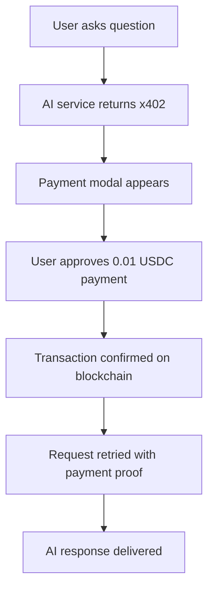
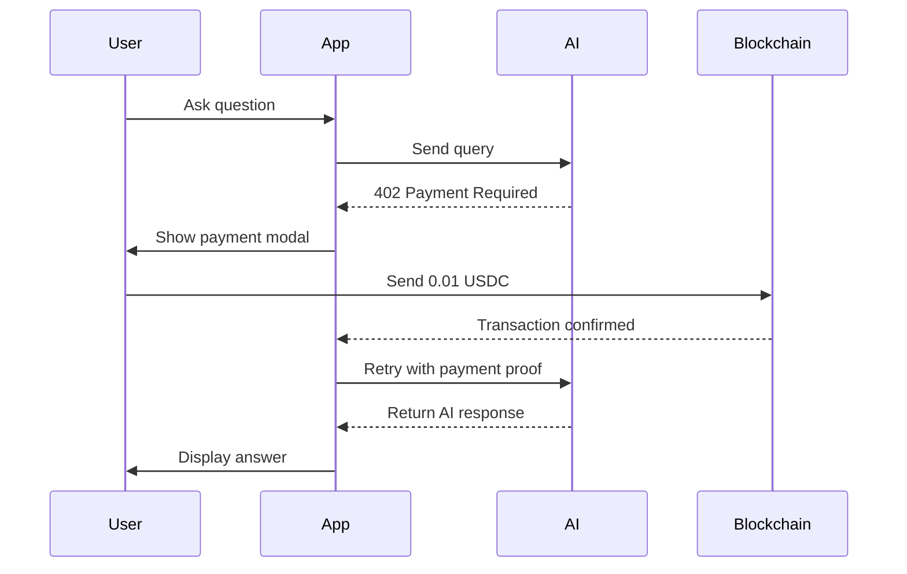

# Tweazy - The best way to read tweets onchain / Powered by x402, MCP & CDP Smart Wallets

The best way to monetize AI applications & MCP, using x402, MCP & CDP Smart Wallets.
Users pay **0.01 USDC** per MCP query, showcasing how to monetize AI services with seamless Web3 payments.

## 📺 See it in Action

[](https://www.youtube.com/watch?v=DNMeMPvgTQk)

## 🚀 What This App Does

This application demonstrates a **pay-per-use AI system** where:

1. **Users connect their wallet** (Smart Wallet with passkeys or non-custodial wallets)
2. **Ask AI questions** through a chat interface
3. **Pay 0.01 USDC per query** automatically via x402
4. **Receive AI-powered responses** after successful payment
5. **Interact with dynamic UI components** generated by AI

Perfect for developers wanting to build **monetized AI applications** with Web3 payments (x402)

## ✨ Key Features

- 🔐 **Dual Wallet Support**: Smart Wallets with Passkeys (CDP) or non-custodial wallets
- 💳 **x402 Payment Gates**: HTTP 402 Payment Required implementation for API access
- 🔑 **Passkey Authentication**: Biometric login with Smart Wallets (most secure, no seed phrases)
- ⛽ **Gas Sponsorship**: Transaction fee sponsorship via paymaster for Smart Wallets
- 🤖 **Tambo AI Integration**: Generative UI with React component registry
- 🔗 **MCP Protocol Support**: Model Context Protocol for extensible AI functionality
- 🌐 **Base Network**: Supports both Base testnet (default) and Base mainnet
- 🛡️ **Production Ready**: Clean architecture with proper error handling
- 🎨 **Dynamic UI**: AI can generate and render React components on demand

## 🚀 Quick Start

### Prerequisites

- Node.js 18+ and npm
- A [Tambo AI API key](https://tambo.co/dashboard) (free tier available)
- A wallet address to receive payments

### Setup

1. **Clone and install**:

   ```bash
   git clone https://github.com/aaronjmars/tweazy
   cd tweazy
   npm install
   ```

2. **Configure environment**:

   ```bash
   # Copy the example environment file
   cp example.env.local .env.local
   ```

3. **Add your API keys** to `.env.local`:

   ```env
   # Required: Get from https://tambo.co/dashboard
   NEXT_PUBLIC_TAMBO_API_KEY=your-tambo-api-key

   # Required: Your wallet address to receive payments
   NEXT_PUBLIC_PAYMENT_RECIPIENT=0x0000CE08fa224696A819877070BF378e8B131ACF

   # Optional: Network mode (defaults to Base testnet for safety)
   NEXT_PUBLIC_NETWORK_MODE=testnet  # or 'mainnet' for production

   # Optional: CDP Wallet credentials (for enhanced wallet features)
   CDP_API_KEY_NAME=your-cdp-key-name
   CDP_API_KEY_PRIVATE_KEY=your-cdp-private-key
   CDP_PROJECT_ID=your-cdp-project-id
   CDP_WALLET_SECRET=your-cdp-wallet-secret
   CDP_PAYMASTER_SERVICE=your-paymaster-service-url
   ```

4. **Start the development server**:

   ```bash
   npm run dev
   ```

5. **Open your browser** to [http://localhost:3000](http://localhost:3000)

### First Steps

1. **Connect a wallet** (Smart Wallet with passkeys recommended for gas-free transactions)
2. **Ask a question** in the chat interface
3. **Confirm the 0.01 USDC payment** when prompted (gas fees may be sponsored)
4. **See your AI response** after successful payment!

## ⚙️ Configuration

### Environment Variables

This app uses a **security-first configuration approach**:

- **Secrets** (API keys, wallet addresses) → Environment variables
- **Non-secrets** (RPC URLs, contract addresses, gas settings) → `src/lib/config.ts`

#### Required Environment Variables

- `NEXT_PUBLIC_TAMBO_API_KEY`: Your Tambo AI API key ([Get one here](https://tambo.co/dashboard))
- `NEXT_PUBLIC_PAYMENT_RECIPIENT`: Wallet address that will receive the 0.01 USDC payments

#### Optional Environment Variables

- `NEXT_PUBLIC_NETWORK_MODE`: `testnet` (default) or `mainnet`
- CDP credentials for enhanced wallet features (see `example.env.local`)

### Network Configuration

The app automatically switches between Base networks based on `NEXT_PUBLIC_NETWORK_MODE`:

#### Testnet Mode (Default - Safe for Development)

- **Network**: Base Sepolia (Chain ID: 84532)
- **USDC Contract**: `0x036CbD53842c5426634e7929541eC2318f3dCF7e`
- **RPC URL**: `https://sepolia.base.org`
- **Features**: Free testnet tokens, no real money at risk

#### Mainnet Mode (Production)

- **Network**: Base Mainnet (Chain ID: 8453)
- **USDC Contract**: `0x833589fCD6eDb6E08f4c7C32D4f71b54bdA02913`
- **RPC URL**: `https://mainnet.base.org`
- **Features**: Real USDC transactions, production-ready

### Easy Network Switching

Change one environment variable to switch networks:

```env
# For development (safe, uses testnet)
NEXT_PUBLIC_NETWORK_MODE=testnet

# For production (real money!)
NEXT_PUBLIC_NETWORK_MODE=mainnet
```

All network-specific settings (RPC URLs, contract addresses, chain IDs) update automatically.

## ⛽ Gas Sponsorship (Paymaster)

**Smart Wallets** benefit from transaction fee sponsorship via paymaster integration:

### How Gas Sponsorship Works

1. **Smart Wallet Selection**: When users choose Smart Wallet with passkeys
2. **Automatic Detection**: System detects Smart Wallet capability for gas sponsorship  
3. **Paymaster Integration**: Gas fees for USDC payments are sponsored via CDP paymaster
4. **User Experience**: Users only pay the 0.01 USDC for AI queries, no gas fees required
5. **Fallback**: If paymaster fails, transaction proceeds with user-paid gas

### Benefits

- 🆓 **Gas-free transactions** for Smart Wallet users
- 🔄 **Automatic handling** - no user configuration needed
- 🛡️ **Reliable fallback** - always works even if sponsorship unavailable
- 💰 **Cost effective** - users only pay for AI queries, not network fees

### Technical Implementation

- **Paymaster URL**: Configured via `CDP_PAYMASTER_SERVICE` environment variable
- **Sponsorship Logic**: Implemented in `src/lib/payment.ts` 
- **User Operations**: ERC-4337 compatible Smart Account transactions
- **Base Network**: Works on both Base Sepolia (testnet) and Base Mainnet

## 🔄 How It Works

### User Flow

1. **🔗 Connect Wallet**: Choose from Smart Wallet (passkeys) or non-custodial wallet
2. **💬 Ask Questions**: Type your question in the chat interface
3. **💳 Payment Prompt**: App shows payment modal for 0.01 USDC
4. **✅ Confirm Payment**: Approve the blockchain transaction (gas fees sponsored for Smart Wallets)
5. **🤖 AI Response**: Receive AI-generated answer with dynamic UI components
6. **🔄 Repeat**: Ask more questions, each requiring a new payment

### Payment Flow (x402 Implementation)



## 💼 Wallet Options

### 🔒 Smart Wallet with Passkeys (Recommended)

**Best for**: New users, gas-free transactions, maximum security

- ✅ **No setup required** - Wallet created automatically via CDP
- ✅ **Biometric authentication** - Use fingerprint, Face ID, or device passkeys
- ✅ **Most secure** - No seed phrases or private keys to manage
- ✅ **Gas sponsorship** - Transaction fees sponsored via paymaster
- ✅ **Instant setup** - Ready in seconds
- ✅ **Auto-configured** - Works on Base Sepolia/Mainnet out of the box

### 🔗 non-custodial wallet

**Best for**: Existing wallet users (MetaMask, Rabby, Coinbase Wallet, etc.)

- 🔧 Any injected Web3 wallet (MetaMask, Rabby, Coinbase Wallet, etc.)
- 🌐 Auto-switches to Base Sepolia network (Chain ID: 84532)
- 💧 Get testnet ETH from [Base Sepolia Faucet](https://www.alchemy.com/faucets/base-sepolia) for gas fees
- 🪙 Get testnet USDC: Contract `0x036CbD53842c5426634e7929541eC2318f3dCF7e`

## 🏗️ Architecture

### Project Structure

```
src/
├── app/                    # Next.js App Router
│   ├── api/               # API routes for CDP wallet operations
│   ├── mcp-config/        # MCP server configuration page
│   └── page.tsx           # Main application page
├── components/            # React components
│   ├── ui/               # Reusable UI components
│   ├── WalletProvider.tsx # Multi-wallet context
│   ├── PaymentModal.tsx   # Payment confirmation UI
│   └── EnhancedMessageInput.tsx # Chat input with payment
├── lib/                   # Core business logic
│   ├── config.ts         # Configuration management
│   ├── payment.ts        # Universal payment handling
│   ├── smart-wallet.ts   # Smart wallet integration
│   ├── cdp-wallet.ts     # Coinbase CDP integration
│   ├── x402.ts           # HTTP 402 handling
│   └── tambo.ts          # AI component registry
└── styles/               # Global styles and Tailwind
```

### Core Systems

#### 💳 Payment System (`src/lib/payment.ts`)

- **Universal payment handling** for both wallet types
- **x402 integration** for payment-gated API calls
- **Paymaster integration** for gas sponsorship on Smart Wallets
- **Transaction validation** and error handling
- **USDC transfers** on Base network

#### 🔐 Wallet Management

- **Smart Wallet** (`src/lib/smart-wallet.ts`): CDP-based passkey authentication with gas sponsorship
- **non-custodial wallet** (via wagmi): Support for all injected Web3 wallets
- **Wallet Provider** (`src/components/WalletProvider.tsx`): Dual-wallet context management

#### 🤖 AI Integration

- **Tambo AI**: React component registry for AI-driven UI
- **MCP Protocol**: Model Context Protocol for extensible AI
- **Dynamic Components**: AI generates and renders React components
- **Payment Gates**: x402 responses trigger payment flows

### API Routes

#### Smart Wallet (CDP) Operations

- `POST /api/cdp/create-wallet` - Create new Smart Wallet via CDP
- `POST /api/cdp/balance` - Check USDC balance
- `POST /api/cdp/transfer` - Execute USDC payments with optional gas sponsorship
- `POST /api/cdp/fund-wallet` - Fund wallet with testnet tokens
- `POST /api/paymaster` - Handle paymaster gas sponsorship for Smart Wallets

### Configuration System

#### Environment-Based Config (`src/lib/config.ts`)

- **Network switching**: Automatic testnet/mainnet configuration
- **Contract addresses**: Network-specific USDC contracts
- **RPC endpoints**: Reliable Base network connections
- **Gas settings**: Optimized transaction parameters

## 🛠️ Development

### Commands

```bash
# Development
npm run dev          # Start development server at localhost:3000
npm run build        # Build production application
npm run start        # Start production server
npm run lint         # Run ESLint for code linting

### Development Workflow

1. **Fork the repository** and clone your fork
2. **Create a feature branch**: `git checkout -b feature/your-feature`
3. **Install dependencies**: `npm install`
4. **Set up environment**: Copy `example.env.local` to `.env.local`
5. **Start development**: `npm run dev`
6. **Make your changes** and test thoroughly
7. **Run linting**: `npm run lint`
8. **Build to verify**: `npm run build`
9. **Commit and push**: Follow conventional commit format
10. **Create a pull request** with detailed description

### Code Style

- **TypeScript**: Strict mode enabled
- **ESLint**: Configured for Next.js and React
- **Prettier**: Code formatting (run with `npm run format`)
- **Conventional Commits**: Use conventional commit format

### Test Scenarios

#### Core Payment Flow

1. **Smart Wallet (Recommended)**:
   - Create passkey → Ask question → Confirm payment (gas-free) → See AI response

2. **non-custodial wallet**:
   - Connect wallet → Switch to Base Sepolia → Ask question → Pay (with gas fees) → See response

### Getting Testnet Tokens

#### For Smart Wallet Users

- **No setup required** - Smart Wallets with gas sponsorship don't need ETH for gas fees
- **USDC only** - Get testnet USDC for payments (contract: `0x036CbD53842c5426634e7929541eC2318f3dCF7e`)

#### For non-custodial wallet Users

- **Base Sepolia ETH (for gas fees)**:
  - [Alchemy Base Sepolia Faucet](https://www.alchemy.com/faucets/base-sepolia)
  - [Coinbase Faucet](https://www.coinbase.com/faucets/base-sepolia-faucet)

- **Base Sepolia USDC (for payments)**:
  - Contract: `0x036CbD53842c5426634e7929541eC2318f3dCF7e`
  - Use a testnet USDC faucet or bridge testnet ETH to USDC

## 🔧 Technical Details

### Wallet Architecture

#### Smart Wallet (CDP with Passkeys)

- **SDK**: Coinbase CDP SDK with Smart Wallet integration
- **Authentication**: WebAuthn passkeys (biometric authentication)
- **Security**: No private keys or seed phrases, device-based authentication
- **Gas Sponsorship**: ERC-4337 paymaster integration for transaction fee sponsorship
- **Network**: Base Sepolia/Mainnet with automatic configuration

#### non-custodial wallet Integration

- **Library**: wagmi + viem for Web3 wallet connections
- **Supported Wallets**: MetaMask, Rabby, Coinbase Wallet, and all injected wallets
- **Network**: Base Sepolia/Mainnet with manual gas fee payment
- **Features**: Standard Web3 wallet connection with user-controlled private keys

### x402 Payment Protocol



### Smart Contracts

#### USDC Contracts

**Testnet (Base Sepolia)**:

- **Address**: `0x036CbD53842c5426634e7929541eC2318f3dCF7e`
- **Chain ID**: 84532
- **Decimals**: 6

**Mainnet (Base)**:

- **Address**: `0x833589fCD6eDb6E08f4c7C32D4f71b54bdA02913`
- **Chain ID**: 8453
- **Decimals**: 6

### Network Configuration

The app automatically switches contracts and RPC endpoints based on `NEXT_PUBLIC_NETWORK_MODE`.

## 🔒 Security Considerations

### Network Safety

⚠️ **Defaults to testnet** for safety - no real money at risk

- **Testnet mode**: All payments use test tokens (no real value)
- **Mainnet mode**: Real USDC transactions - use with caution
- **Always verify** `NEXT_PUBLIC_NETWORK_MODE` before deployment

### Wallet Security

- **Smart Wallets**: Most secure - use passkeys, no private keys, gas sponsorship included
- **non-custodial wallets**: User-controlled private keys, manual gas fee management
- **Payment validation**: All transactions verified on-chain
- **Gas sponsorship**: Smart Wallets benefit from paymaster-sponsored transactions

## 🤝 Contributing

We welcome contributions! Here's how to get started:

### Quick Contribution Guide

1. **Fork** the repository
2. **Create** a feature branch: `git checkout -b feature/amazing-feature`
3. **Make** your changes
4. **Test** thoroughly (run `npm run build` and `npm run lint`)
5. **Commit** using conventional commits: `feat: add amazing feature`
6. **Push** to your fork: `git push origin feature/amazing-feature`
7. **Create** a Pull Request with detailed description

### What We're Looking For

- 🐛 **Bug fixes** and improvements
- ✨ **New AI components** for the registry
- 🔧 **Wallet integrations** (new wallet types)
- 📚 **Documentation** improvements
- 🧪 **Test coverage** enhancements
- 🎨 **UI/UX** improvements

### Development Guidelines

- **TypeScript**: Use strict typing
- **Testing**: Add tests for new features
- **Documentation**: Update README for new features
- **Code style**: Follow existing patterns
- **Commits**: Use conventional commit format

## 📚 Resources & Documentation

### Core Technologies

- **[Tambo AI](https://tambo.co)**: Generative UI framework with MCP support
- **[Tambo GitHub](https://github.com/tambo-ai/tambo)**: Component registry and MCP integration
- **[Next.js](https://nextjs.org)**: React framework for production
- **[Tailwind CSS](https://tailwindcss.com)**: Utility-first CSS framework

### Web3 & Blockchain

- **[Coinbase CDP](https://docs.cdp.coinbase.com)**: Coinbase Developer Platform
- **[Base Network](https://base.org)**: Ethereum L2 network
- **[wagmi](https://wagmi.sh)**: React hooks for Ethereum
- **[viem](https://viem.sh)**: TypeScript interface for Ethereum

### Protocols & Standards

- **[x402 Standard](https://tools.ietf.org/html/rfc7231#section-6.5.2)**: HTTP 402 Payment Required
- **[MCP Protocol](https://modelcontextprotocol.io)**: Model Context Protocol
- **[WebAuthn](https://webauthn.io)**: Web Authentication API (for passkeys)

## 🆘 Support & Troubleshooting

### Common Issues

#### "Payment recipient not configured"

- Set `NEXT_PUBLIC_PAYMENT_RECIPIENT` in `.env.local`
- Use a valid Ethereum address

#### "Tambo API key not found"

- Get API key from [tambo.co/dashboard](https://tambo.co/dashboard)
- Set `NEXT_PUBLIC_TAMBO_API_KEY` in `.env.local`

#### "Insufficient balance"

- Get testnet tokens from Base Sepolia faucets
- Ensure you have both ETH (gas) and USDC (payments)

#### "Network not supported"

- Check MetaMask is connected to Base Sepolia (Chain ID: 84532)
- Verify `NEXT_PUBLIC_NETWORK_MODE` setting

### Getting Help

- 📖 **Check the docs** above for detailed information
- 🐛 **Open an issue** for bugs or feature requests
- 💬 **Start a discussion** for questions or ideas
- 🔍 **Check console logs** for detailed error information

### Debug Mode

Enable debug logging by adding to `.env.local`:

```env
NEXT_PUBLIC_DEBUG=true
```

---

## 🚀 Ready to Build?

This project demonstrates the future of **monetized AI applications** with seamless Web3 payments. Fork it, customize it, and build the next generation of payment-gated AI services!

**Happy coding!** 🎉
